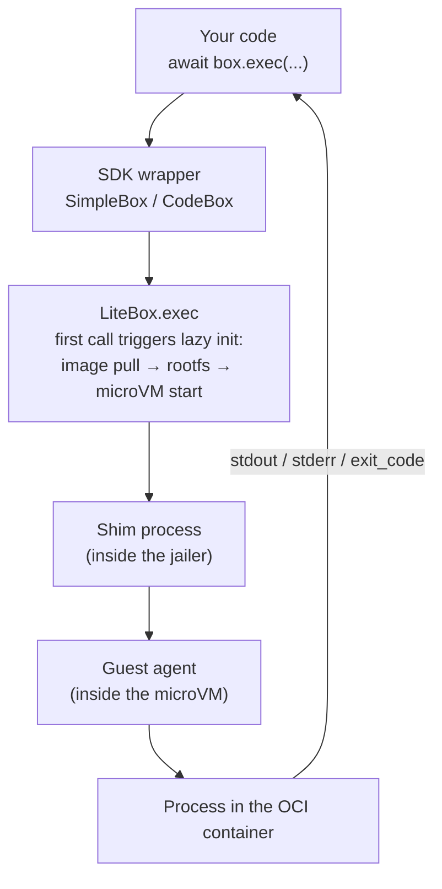
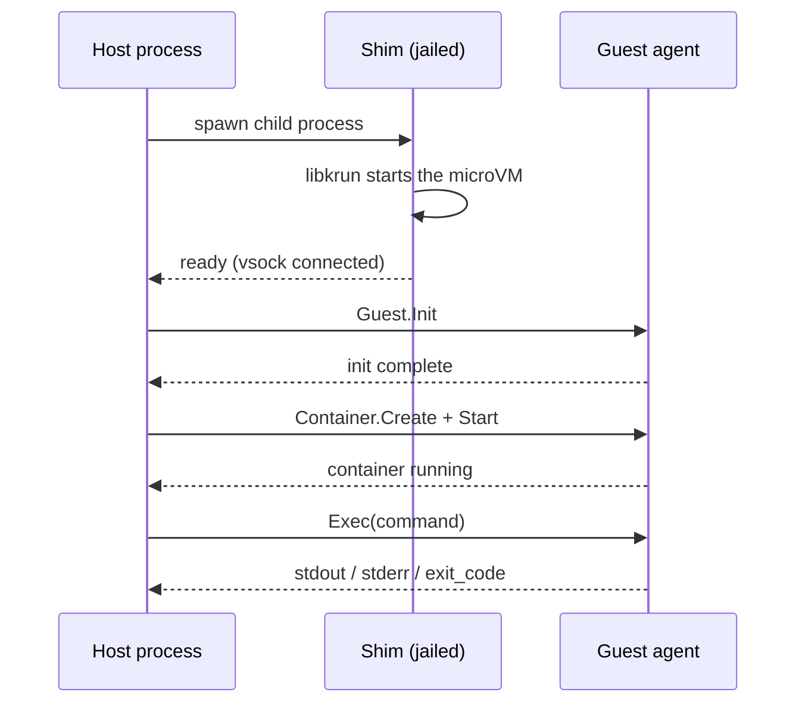
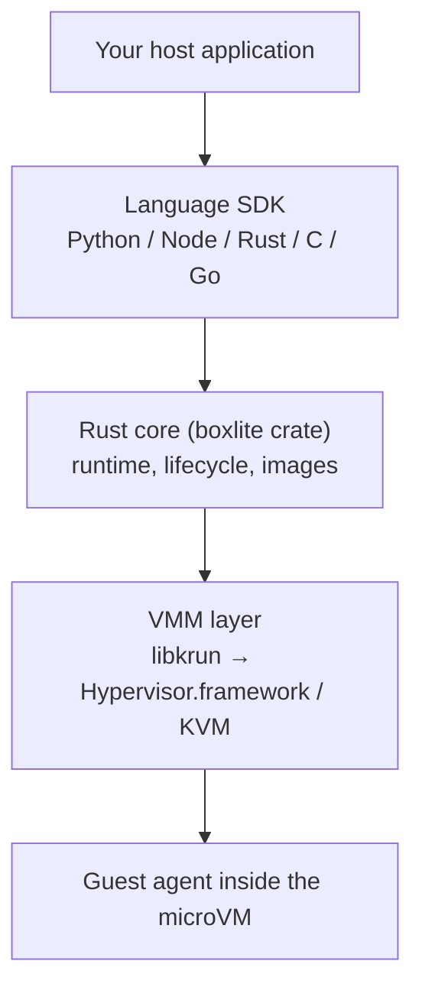

BoxLite follows SQLite's model: embedded in your process as a library, with no daemon and no external service. A **Box** is an isolated execution environment implemented as a lightweight microVM behind a container-like interface.

## Component Overview (Under the Hood)

Inside the host process, BoxLite is a library that descends through the **shim** — a small sandboxed child process that hosts the virtual machine — and finally reaches the guest agent inside the microVM. From top to bottom there are three regions:

### Core component responsibilities

| Component | Layer | Role | Source |
|---|---|---|---|
| `BoxliteRuntime` | Host process | Global entry point: create/list/remove Boxes, manage images and global metrics. One `BOXLITE_HOME` allows only one runtime instance at a time. | `src/boxlite/src/runtime/` |
| `LiteBox` | Host process | Handle for a single Box. **Lazy initialization**: `create()` returns immediately; the image pull and microVM startup are deferred to first use, so creating a Box is cheap. | `src/boxlite/src/litebox/` |
| `ImageManager` | Host process | OCI image pull and layered caching (blobs deduplicated by digest, base layers shared across Boxes). The first pull is slow; later starts hit the cache and are fast. | `src/boxlite/src/images/` |
| `ShimController` | Host process → child process | When libkrun starts the microVM it takes over the process and never returns, so it must run in a separate child process or it would block the host application. | `src/boxlite/src/vmm/controller/` |
| Jailer | OS sandbox boundary | Adds a layer of OS isolation (seccomp / namespace / chroot / cgroups) on top of hardware virtualization, for defense in depth. | `src/boxlite/src/jailer/` |
| libkrun (Vmm) | Inside the shim child process | The virtual machine monitor used in production. Provides virtio-fs (file sharing), virtio-blk (disk), and vsock (host-guest communication). | `src/boxlite/src/vmm/krun/` |
| Guest Agent | Inside the guest microVM | A gRPC server running inside the Box that receives host commands and executes them in the OCI container. | `src/guest/` (crate `boxlite-guest`) |
| Portal | Host ↔ guest | The host-side gRPC communication facade (`GuestSession` / `Connection` / the service interfaces). | `src/boxlite/src/portal/` |
| Network backend | Shim child process | Pluggable user-space networking: `gvproxy` by default, `libslirp` as an alternative. Provides outbound access, port forwarding, and DHCP/DNS. | `src/boxlite/src/net/` |
| Shared types | Full stack | Data types, error definitions, the proto protocol, and constants shared by host / shim / guest. | `src/shared/` (crate `boxlite-shared`) |

---

## One exec, end to end

This code is the smallest observable unit for understanding the architecture: it walks the full chain **host application → runtime → Box handle → execution inside the guest agent**, and prints what each layer exposes (Box state, exit code, runtime metrics).


<CodeGroup>

```python Python
# pip install boxlite
import asyncio

from boxlite import SimpleBox, BoxliteError

async def main() -> None:
    # 1) Entering SimpleBox's async context triggers the "lazy initialization" pipeline:
    #    image pull -> rootfs preparation -> Box (microVM) startup -> guest ready
    try:
        async with SimpleBox(image="alpine:latest") as box:
            # 2) on SimpleBox, info() is a coroutine. state is a BoxStateInfo; the field is named status.
            info = await box.info()
            print(f"box id={box.id}  state={info.state.status}")

            # 3) exec sends the command to the guest agent over gRPC, carried on a host<->guest virtual socket,
            #    running it in the OCI container inside the sandbox. A non-zero exit *does not* raise; check exit_code yourself.
            result = await box.exec("echo", "hello from inside the box")
            print(f"exit_code={result.exit_code}  stdout={result.stdout.strip()!r}")
    except BoxliteError as exc:
        # Operational error (e.g. a wrapped execution error).
        print(f"BoxLite error: {exc}")
    except RuntimeError as exc:
        # Environment-level error: missing virtualization / image pull failure, etc. raise a standard RuntimeError.
        print(f"runtime/environment error (no KVM? network?): {exc}")

if __name__ == "__main__":
    asyncio.run(main())
```

```typescript Node.js
// npm install @boxlite-ai/boxlite   (package name is @boxlite-ai/boxlite)
import { SimpleBox, BoxliteError } from "@boxlite-ai/boxlite";

async function main(): Promise<void> {
  try {
    // SimpleBox uses "await using" (asyncDispose) for automatic cleanup.
    await using box = new SimpleBox({ image: "alpine:latest" });

    const result = await box.exec("echo", "hello from inside the box");
    console.log(`exitCode=${result.exitCode} stdout=${result.stdout.trim()}`);
  } catch (err) {
    if (err instanceof BoxliteError) {
      console.error(`BoxLite error: ${err.message}`);
    } else {
      console.error(`runtime/environment error: ${(err as Error).message}`);
    }
  }
}

main();
```

</CodeGroup>

The layer each step maps to is shown in the data-flow diagram in the next section.

---

## Data Flow: How a Command Reaches the Box

Expanding the `await box.exec("echo", ...)` from the [Quick Example](#one-exec-end-to-end), it passes through the chain below. Each step is annotated with the entity it maps to in the source or the API:



Initialization sequence (happens once, the first time you use a new Box):



Key design points (they affect how you write code):

- **Lazy initialization.** Before `runtime.create()` or entering `async with SimpleBox(...)`, the Box has not actually started. The initialization cost is paid once on the first `exec`/`start`, so the first command is slower than later ones.
- **Streaming I/O.** The native Rust `ExecResult` **contains only `exit_code`**; stdout/stderr are read as streams, and the Python/Node wrapper layer aggregates them into `stdout`/`stderr` strings.
- **A non-zero exit does not raise.** `exec` returns a result carrying `exit_code` (Python) / `exitCode` (Node), which you check yourself. A standard exception is raised only when the command does not exist or virtualization is unavailable (see [Troubleshooting](#troubleshooting)).

---

## Security Layering: Jailer + Hardware Virtualization

BoxLite's isolation uses **defense in depth**: beyond the hardware virtualization (microVM), the jailer also sandboxes the shim process that hosts the VM.


| Platform | OS-level isolation mechanisms |
|---|---|
| Linux | namespaces (mount/PID/network) · chroot/pivot_root · seccomp BPF syscall filtering · privilege drop to an unprivileged user · cgroups v2 resource limits |
| macOS | sandbox-exec (Seatbelt) kernel-level sandbox · rlimits resource constraints |

**Most users do not need to configure security options**: the defaults favor compatibility. When you need stronger isolation, security options are passed through `advanced` (there is **no** top-level `security=` keyword). `AdvancedBoxOptions` is exported only under the `boxlite.boxlite` submodule:

```python
# pip install boxlite
import asyncio

from boxlite import SimpleBox, BoxOptions, SecurityOptions, BoxliteError
from boxlite.boxlite import AdvancedBoxOptions  # only under boxlite.boxlite; not exported at the top level

async def main() -> None:
    # Security options must be passed via advanced=AdvancedBoxOptions(security=...).
    # There are only three presets: development() / standard() / maximum() (no .minimum()).
    opts = BoxOptions(
        image="alpine:latest",
        advanced=AdvancedBoxOptions(security=SecurityOptions.maximum()),
    )
    try:
        # SimpleBox accepts BoxOptions' keywords directly; this shows fields aligned with the underlying BoxOptions.
        async with SimpleBox(image="alpine:latest", advanced=opts.advanced) as box:
            result = await box.exec("id")
            print(result.stdout.strip())
    except RuntimeError as exc:
        print(f"environment error: {exc}")

if __name__ == "__main__":
    asyncio.run(main())
```

The full threat model is in the repository at `src/boxlite/src/jailer/THREAT_MODEL.md`.

---

## SDK Layering: From Your Code to the Rust Core

Every language SDK is a thin wrapper over the same Rust core library:



| SDK | Binding technology | Package / location | High-level entry point (recommended) |
|---|---|---|---|
| Python | PyO3 + maturin | `boxlite` · `sdks/python/` | `SimpleBox` / `CodeBox` / `BrowserBox` / `ComputerBox` / `InteractiveBox` / `SkillBox` |
| Node.js | napi-rs | `@boxlite-ai/boxlite` · `sdks/node/` | Same as above (camelCase method names) |
| C | cbindgen FFI (callback + post-and-drain model) | `boxlite.h` · `sdks/c/` | `boxlite_simple_*` (synchronous) / native callback-based API |
| Go | CGO + prebuilt native lib | `sdks/go` | `Runtime` / `Box` |
| Rust | — | crate `boxlite` · `src/boxlite/src/` | `BoxliteRuntime` / `LiteBox` |

**Easy-to-miss cross-layer conventions** (note these before writing code):

| Convention | Python | Node |
|---|---|---|
| Runtime handle type | `Boxlite` (synchronous context manager) | `JsBoxlite` (a plain object whose methods return Promises) |
| Box wrapper class | `SimpleBox`, etc. (**async** `async with`) | `SimpleBox`, etc. (`await using`) |
| List Boxes | `runtime.list_info()` (not `list()`) | `runtime.listInfo()` |
| Remove a Box | `runtime.remove(id, force=False)` (on the runtime, not `box.remove()`) | `runtime.remove(id, force?)` |
| Read Box state | `(await box.info()).state.status` on `SimpleBox`; `box.info()` is synchronous only on the native `Box`. Outer `state`, inner field `status` | `(await box.info()).state.status` — Node returns a `Promise` on every type |

Detailed APIs for each high-level Box are on the corresponding feature pages; the full methods of the runtime and the low-level `Box` are on the SDK reference pages.

---

## Parameters and Returns

This is a conceptual page and takes no parameters. Below is a summary of the methods the architecture walkthrough **calls directly**, for quick reference (full signatures are on the SDK reference pages).

### `BoxliteRuntime` (runtime handle, Python `Boxlite` / Node `JsBoxlite`)

| Method | Sync/async | Description |
|---|---|---|
| `create(options, name=None)` | Python sync / Node Promise | Create a Box handle (lazy init; does not start the microVM immediately) |
| `get_or_create(options, name=None)` | Same | Reuse by name or create a new one |
| `list_info(_state=None)` | Same | List the `BoxInfo` of all Boxes (newest first) |
| `remove(id_or_name, force=False)` | Same | Remove the specified Box |
| `metrics()` | Same | Return `RuntimeMetrics` (see the field table below) |
| `shutdown(timeout=None)` / `close()` | Same | Shut down the runtime (`None` ≈ 10s, `-1` = wait indefinitely) |

### `LiteBox` (the low-level Box, Python `Box` / Node `JsBox`)

| Method | Sync/async | Description |
|---|---|---|
| `start()` / `stop()` | async | Start (idempotent) / stop the microVM |
| `exec(...)` | async | Execute a command; a non-zero exit **does not raise** |
| `info()` | **sync on native `Box`**, coroutine on `SimpleBox` | Return `BoxInfo` |
| `metrics()` | async | Return `BoxMetrics` (see the field table below) |

> Wrappers such as `SimpleBox` are not subclasses of the low-level `Box` — each one **holds** a `Box` internally. That is why some low-level methods (`metrics()`, for example) are not available on a wrapper directly.

### Metrics fields (real field names, commonly mistyped)

| Type | Correct fields |
|---|---|
| `BoxMetrics` (Python) | `memory_bytes` · `cpu_percent` |
| `RuntimeMetrics` (Python) | `num_running_boxes` · `boxes_created_total` · `boxes_failed_total` · `total_commands_executed` · `total_exec_errors` |
| Node metrics | Same fields in camelCase, with a `Total` suffix (`commandsExecutedTotal`, and so on) |

---

## Going deeper

Using BoxLite requires none of what follows. Read one of these when you have a specific question:

| Question | Page |
|---|---|
| Which layer is which, and where does my problem live? | [Core components](/architecture/core-components) |
| How strong is the isolation, and what does each `SecurityOptions` field change? | [Security and isolation](/architecture/security-and-isolation) |
| How does traffic leave the box? | [Networking](/architecture/networking) |
| Where does a box's disk state live? | [Storage](/architecture/storage) |
| Why is the first start slow and later starts fast? | [Boot latency](/architecture/boot-latency) |

## Troubleshooting

### Startup failure: `Could not access KVM` / no virtualization

**Symptom:** entering `async with SimpleBox(...)` raises `RuntimeError`.

**Cause:** a Box is a microVM and needs hardware virtualization.

| Platform | Check |
|---|---|
| Linux | `ls -l /dev/kvm`; the current user must be in the `kvm` group (`sudo usermod -aG kvm $USER`, then re-login) |
| macOS | No `/dev/kvm` needed; uses Hypervisor.framework; Apple Silicon supported |
| WSL2 | Nested virtualization + KVM enabled, user in the `kvm` group |
| Cloud/CI | Most shared runners do not expose `/dev/kvm`; you need a "nested virtualization" instance |

The exception can be caught with `try/except RuntimeError`; the host process does not crash.

### `exec` returned, but the command actually failed

`exec` **does not raise on a non-zero exit code** — this is intended behavior:

```python
result = await box.exec("ls", "/nonexistent")
if result.exit_code != 0:
    print(f"failed: {result.stderr.strip()}")  # check exit_code yourself; do not rely on an exception
```

The same applies in Node: check `result.exitCode`.

### A missing command / image pull failure raises a standard exception, not `BoxliteError`

A missing command or an image pull failure raises a standard `RuntimeError` (Python) / bare `Error` (Node), not `BoxliteError`. See [Error Handling](/guides/error-handling#troubleshooting).

### Passing a string as the volume's third element errors

A volume's third element is the boolean `read_only`; the strings `"ro"`/`"rw"` are CLI-only and raise `TypeError` here. See [Volumes](/manage-sandbox/volumes#troubleshooting).

> Note: only the **CLI**'s `-v host:box:ro` uses the `ro`/`rw` strings; the SDK API uses a bool. Do not confuse the two.

### `AdvancedBoxOptions` import raises `ImportError`

`AdvancedBoxOptions` lives in the `boxlite.boxlite` submodule, not the top level. See [Inject secrets and harden a box](/manage-sandbox/secrets-and-security#troubleshooting).

Likewise, security options are passed via `BoxOptions(advanced=AdvancedBoxOptions(security=SecurityOptions.maximum()))`; the top-level `BoxOptions` has **no** `security=` keyword.

### Reading Box state raises `AttributeError: 'BoxInfo' object has no attribute 'status'`

State has two levels: `BoxInfo.state` is a `BoxStateInfo`, and you then take its `.status` (a string):

```python
info = box.info()                 # native Box: synchronous. On SimpleBox: await box.info()
print(info.state.status)          # correct: outer state, inner status
# Wrong: info.status              -> AttributeError
```

### Mixing up the context-manager types of `Boxlite` and `Box`

- Python `Boxlite` (the runtime) is a **synchronous** context manager: `with Boxlite.default() as rt:`.
- Python `Box`/`SimpleBox`/`CodeBox`, etc. are **async** context managers: `async with SimpleBox(...) as box:`.

Writing the synchronous runtime as `async with`, or a Box as a synchronous `with`, triggers a `TypeError` from the context-manager protocol.
