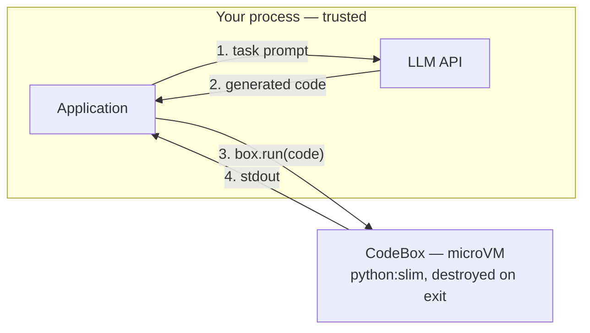

**Outcome:** a working `natural language -> generated code -> isolated execution -> result` loop.

**Level:** beginner · **Time:** ~10 minutes · **Pattern:** the box is a tool the model calls.

## When to use this

Any application that executes model-generated code hits the same wall: **you cannot review that code before it runs.** It may delete files, loop forever, or read your environment variables. Calling `exec()` on it inside your own process hands your full privileges to a script nobody has read.

`CodeBox` closes that gap. Each snippet runs in its own microVM with its own kernel, filesystem, and resource budget, and the VM is destroyed when the scope exits. Your process keeps the API keys and the business logic; only the untrusted code crosses the boundary.

Typical products built this way: data-analysis assistants, "compute this in plain English" tools, AI programming helpers, and homework/grading systems that execute submissions.

## Architecture



Orchestration, credentials, and business logic stay in the trusted process. Only the generated code enters the isolated environment, and it arrives in a clean `python:slim` with nothing of yours in it.

## Prerequisites

- BoxLite installed and a working virtualization host — see [Installation](/getting-started/installation).
- An OpenAI-compatible LLM endpoint. This guide reads `OPENAI_API_KEY`, and `OPENAI_BASE_URL` if you point at a different provider.

```bash
pip install boxlite openai
```

## Build it

The whole loop, ready to copy and run:

```python
import asyncio
import re

from boxlite import CodeBox
from openai import OpenAI

client = OpenAI()  # reads OPENAI_API_KEY (and OPENAI_BASE_URL if set)


def extract_code(text: str) -> str:
    """Pull the code out of a fenced block in the model's reply."""
    match = re.search(r"```(?:python)?\n(.*?)```", text, re.S)
    return (match.group(1) if match else text).strip()


async def run_with_interpreter(task: str) -> str:
    # 1) Ask the model for code
    response = client.chat.completions.create(
        model="<YOUR_MODEL>",  # e.g. "gpt-4o-mini", or any model id your endpoint serves
        messages=[
            {"role": "user", "content": f"Write Python code (no explanation) for: {task}"}
        ],
    )
    code = extract_code(response.choices[0].message.content)

    # 2) Execute it in an isolated microVM; the box is destroyed when the block exits
    async with CodeBox() as box:
        return await box.run(code)  # run() returns the stdout string


async def main() -> None:
    try:
        output = await run_with_interpreter(
            "Compute the first 10 prime numbers and print them as a list."
        )
        print(output)
    except RuntimeError as exc:
        # Image pull failure or no hardware virtualization surface here
        print(f"sandbox failed to start: {exc}")


asyncio.run(main())
```

`CodeBox.run(code)` returns **stdout as a string**. When you need stderr or the exit code — which you will, as soon as the model writes code that raises — use `exec` instead:

```python
result = await box.exec("python3", "-c", code)
print(result.exit_code, result.stdout, result.stderr)
```

Full parameter tables for both entry points: [Run Python code in a box](/agent-tools/code-execution-python).

## Run it

```bash
export OPENAI_API_KEY="<YOUR_API_KEY>"
python interpreter.py
```

```text
[2, 3, 5, 7, 11, 13, 17, 19, 23, 29]
```

That list was computed inside the microVM, not on your machine. The first run also pulls `python:slim`, which can take tens of seconds; later runs start in about two seconds.

## Trust and limits

- **What the boundary covers.** The generated code gets its own kernel and filesystem and is memory-isolated from your process. `rm -rf /` inside the box cannot reach the host, and the box is destroyed when the scope exits.
- **The box has full outbound network by default.** Isolation is not the same as containment: code in the box can still reach the internet. If the threat you care about is exfiltration rather than damage, add an egress allowlist — see [Harden the box for untrusted code](/agent-tools/code-execution-any-language#harden-the-box-for-untrusted-code).
- **Failures are catchable.** A missing hypervisor or a failed image pull raises `RuntimeError` in Python (a bare `Error` in Node), not a process crash.
- **`run()` hides errors by design.** It returns stdout only. A traceback lands in stderr and you will see an empty string. Use `exec` while you are debugging what the model produced.

## Troubleshooting

| Symptom | Cause | Fix |
|---|---|---|
| `run()` returns an empty string | The generated code raised; the traceback went to stderr | Switch to `exec("python3", "-c", code)` and read `stderr` / `exit_code` |
| `Model does not exist` (HTTP 400) | `OPENAI_BASE_URL` points at another provider but the model id is still an OpenAI one | Use a model id that endpoint actually serves |
| `RuntimeError` on startup | No hardware virtualization, or the image pull failed | Check KVM (Linux) or Hypervisor.framework (macOS); see [Installation](/getting-started/installation) |
| First run takes tens of seconds | The base image is being pulled | Expected once per image; subsequent starts are ~2s |

## Next steps

- **Give the model a tool interface instead of a one-shot call** — [Drive a sandbox from your agent loop](/agent-tools/drive-from-agent-loop).
- **Analyze a real dataset** — [Data analysis agent](/use-cases/data-analysis-agent) adds `copy_in` / `copy_out` and charts.
- **Lock the box down** — [Run untrusted tools safely](/use-cases/untrusted-tool-execution).
