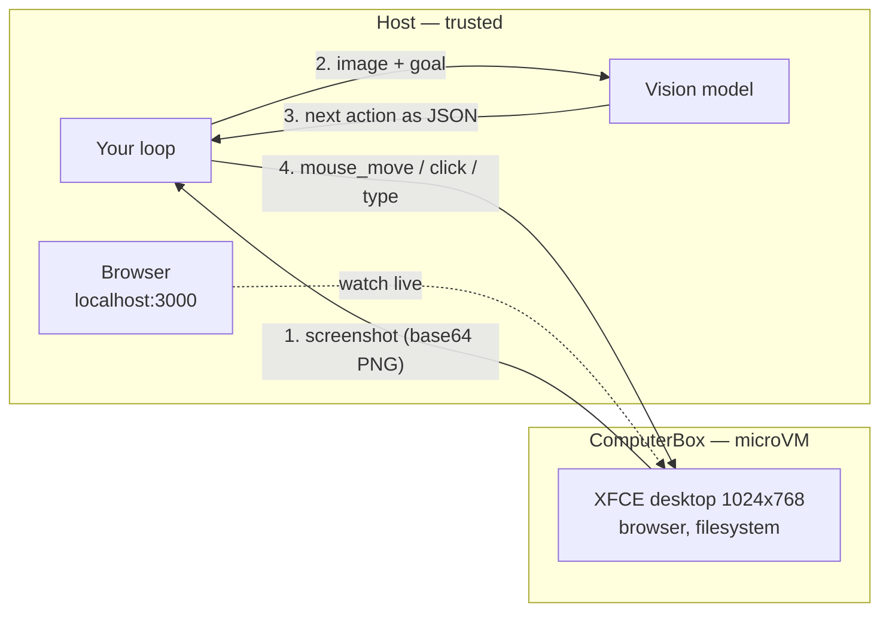

**Outcome:** a working `screenshot -> vision model -> desktop action` loop, watchable live in a browser.

**Level:** intermediate · **Time:** ~15 minutes · **Pattern:** the agent lives in the box.

## When to use this

Some systems have no API — only an interface. Placing an order in a legacy ERP web app, clicking through a desktop configuration, exporting a report from a SaaS product with no SDK. Selector-based automation is brittle here, and sometimes simply impossible.

Computer use takes the other road: a multimodal model looks at the screen and acts like a person. That is powerful and inherently dangerous — you have handed a program that decides its own clicks a machine with a filesystem and a network connection. **One wrong click can really delete a file or really submit an order.**

`ComputerBox` bounds that risk. It boots an XFCE desktop with a browser inside a microVM and exposes mouse, keyboard, and screenshots as async methods. The agent works on a disposable machine that is fully isolated from your host, and you can watch it in a browser the whole time.

Fits: automating GUI-only systems, evaluation sandboxes for computer-use agents, and high-risk desktop work that needs a human watching.

## Architecture



Two channels reach the same desktop: your program drives it through `ComputerBox` methods, and a person watches through the forwarded HTTP port. The loop itself is `observe -> think -> act`, repeated.

## Prerequisites

- BoxLite installed and a working virtualization host — see [Installation](/getting-started/installation).
- A vision-capable model on an Anthropic-compatible endpoint.
- The first run pulls the desktop image, which is large. Allow several minutes and use a generous `wait_until_ready` timeout.

```bash
pip install boxlite anthropic
```

## Build it

One full turn of the loop: take a screenshot, let the model read it and choose the next action, execute that action on the real desktop, then confirm.

```python
import asyncio
import json
import os
import re

import anthropic
from boxlite import ComputerBox

vision = anthropic.Anthropic(
    base_url=os.environ["ANTHROPIC_BASE_URL"],   # <YOUR_ANTHROPIC_COMPATIBLE_BASE_URL>
    api_key=os.environ["ANTHROPIC_API_KEY"],     # <YOUR_API_KEY>
)
VISION_MODEL = "<YOUR_VISION_MODEL>"             # any model id that accepts images

# The action vocabulary maps one-to-one onto ComputerBox methods
SYSTEM = """You operate a Linux desktop (1024x768) via screenshots.
Look at the screenshot and decide the SINGLE next action toward the goal.
Return ONLY one JSON object, no prose:
  {"action":"mouse_move","x":<int>,"y":<int>}
  {"action":"left_click"}
  {"action":"double_click"}
  {"action":"type","text":"<str>"}
  {"action":"key","text":"<xdotool keyname, e.g. Return, ctrl+a>"}
  {"action":"scroll","x":<int>,"y":<int>,"direction":"up|down","amount":<int>}
"""


def text_of(response) -> str:
    """Return the last text block — some models emit a thinking block first."""
    out = None
    for block in response.content:
        if block.type == "text":
            out = block.text
    return out or ""


def extract_action(text: str) -> dict:
    match = re.search(r"\{.*\}", text, re.S)
    return json.loads(match.group(0) if match else text)


async def run_action(desktop, action: dict) -> None:
    """Apply one model-chosen action to the real desktop."""
    kind = action["action"]
    if kind == "mouse_move":
        await desktop.mouse_move(int(action["x"]), int(action["y"]))
    elif kind == "left_click":
        await desktop.left_click()
    elif kind == "double_click":
        await desktop.double_click()
    elif kind == "type":
        await desktop.type(action["text"])
    elif kind == "key":
        await desktop.key(action["text"])          # e.g. "Return", "ctrl+a"
    elif kind == "scroll":
        await desktop.scroll(int(action["x"]), int(action["y"]),
                             action["direction"], int(action.get("amount", 3)))
    print(f"executed: {kind} {action}")


async def main() -> None:
    goal = ("As a concrete first step, move the mouse to the center "
            "of the screen at coordinates (512, 384).")

    try:
        async with ComputerBox(cpu=2, memory=2048) as desktop:
            # The first run pulls a large image; be generous with the timeout
            await desktop.wait_until_ready(timeout=180)

            # 1) Observe — screenshot() returns a dict with base64 PNG in ["data"]
            shot = await desktop.screenshot()
            print(f"screenshot {shot['width']}x{shot['height']} {shot['format']}")

            # 2) Think — hand the image to the vision model
            response = vision.messages.create(
                model=VISION_MODEL,
                max_tokens=512,
                system=SYSTEM,
                messages=[{"role": "user", "content": [
                    {"type": "image", "source": {
                        "type": "base64", "media_type": "image/png",
                        "data": shot["data"],
                    }},
                    {"type": "text", "text": f"Goal: {goal}\nWhat is the next single action?"},
                ]}],
            )
            action = extract_action(text_of(response))
            print(f"model chose: {action}")

            # 3) Act — then verify by reading the cursor and re-shooting
            await run_action(desktop, action)
            x, y = await desktop.cursor_position()
            print(f"cursor now at ({x}, {y})")
            await desktop.screenshot()
    except TimeoutError:
        print("the desktop did not become ready in time — raise the timeout")
    except RuntimeError as exc:
        print(f"sandbox failed to start: {exc}")


asyncio.run(main())
```

The full method list and the `screenshot()` return shape are on [Computer use (desktop)](/agent-tools/computer-use#parameters-returns).

## Run it

```bash
export ANTHROPIC_BASE_URL="<YOUR_ANTHROPIC_COMPATIBLE_BASE_URL>"
export ANTHROPIC_API_KEY="<YOUR_API_KEY>"
python computer_use.py
```

```text
screenshot 1024x768 png
model chose: {'action': 'mouse_move', 'x': 512, 'y': 384}
executed: mouse_move {'action': 'mouse_move', 'x': 512, 'y': 384}
cursor now at (512, 384)
```

The model looked at a real desktop and its decision moved a real cursor. Open `http://localhost:3000` while the script runs to watch it happen.

## Trust and limits

- **What the boundary covers.** The entire desktop — window manager, browser, filesystem — runs in a microVM. An agent that deletes files, installs software, or fills in a form affects only that machine, and it is destroyed when the block exits.
- **Coordinates are the agent's whole world.** It acts on pixel positions from a 1024x768 screenshot. If a dialog moves or a font renders differently, a click lands somewhere unintended. Verify after acting — read `cursor_position()` or take another screenshot — rather than assuming the action did what the model meant.
- **Network is open by default.** A browser on that desktop reaches the internet. For untrusted goals, narrow egress: [Run untrusted tools safely](/use-cases/untrusted-tool-execution).
- **The desktop is heavy.** `ComputerBox` defaults to 2 vCPU and 2048 MiB and pulls a large image on first use. It is not a per-request primitive; keep one alive for a session rather than starting one per action.
- **`wait_until_ready` can time out.** It raises `TimeoutError` — a catchable failure, not a crash. Raise the timeout on first pull.

## Troubleshooting

| Symptom | Cause | Fix |
|---|---|---|
| `TimeoutError` from `wait_until_ready` | The image is still being pulled, or the host is resource-constrained | Raise the timeout (180s or more on the first run) and confirm free memory |
| The model returns prose instead of JSON | The system prompt was not followed, or a thinking block came first | Take the **last** text block, as `text_of` does, and re-prompt with a stricter instruction |
| `KeyError` reading the screenshot | `screenshot()` returns a dict — `data`, `width`, `height`, `format` | Use `shot["data"]` for the base64 PNG |
| The action executes but nothing changes | Coordinates were computed against a different resolution | The desktop is 1024x768; confirm with `get_screen_size()` |
| Cannot reach `localhost:3000` | The desktop is not ready yet | Wait for `wait_until_ready`, then open the port |

## Next steps

- **Loop it.** Wrap observe-think-act in a `while` loop with a step budget and a stop condition, re-screenshotting after each action.
- **Keep a human in the loop.** For high-risk goals, require confirmation before actions such as `left_click` on a submit button.
- **Prefer the browser when a page will do.** Driving a page directly is far more reliable than pixel-clicking — see [Scrape and analyze the web](/use-cases/web-scraping-agent).
- **Watch a coding agent instead.** [Run Claude Code](/agent-in-box/run-claude-code) puts an autonomous coding agent in a box with the same desktop channel.
