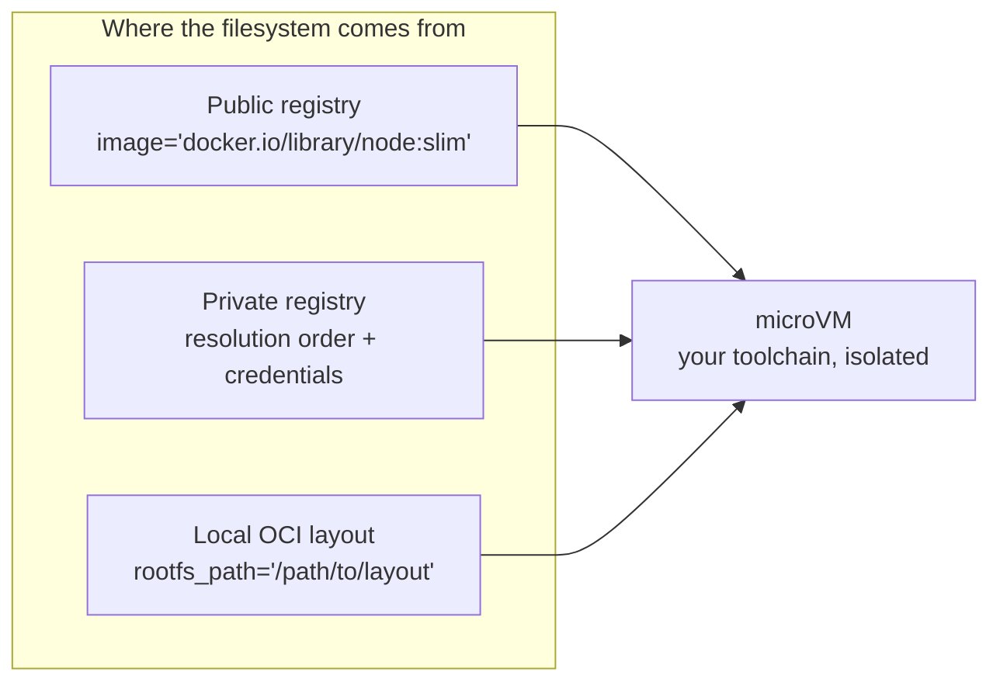

**Outcome:** boxes that start with your compilers, CLIs, and pinned dependencies already present.

**Level:** beginner+ · **Time:** ~10 minutes · **Pattern:** the agent lives in the box.

## When to use this

The default sandbox image is clean, which also means it is empty. As soon as an agent needs a specific toolchain — a Node stack, `ffmpeg`, a compiler, an internal CLI, a set of pinned versions — installing it after every boot is slow, not reproducible, and fails outright when the network is restricted.

More often, **you already have the image.** Your team's standard dev image, your CI image, or a project's official image. You just want the agent to live in it.

BoxLite reduces that to one parameter: pass an image reference to `image=` to pull from a registry, or a local OCI image layout directory to `rootfs_path=` for offline use. Whatever the image contains, the box has — and every box is still a fully isolated microVM.

## Architecture



The isolation properties do not change with the source. A custom image widens what the agent can *do*; it does not widen what it can *reach*.

## Prerequisites

- BoxLite installed and a working virtualization host — see [Installation](/getting-started/installation).
- Network access to your registry, or a local OCI image layout on disk.

## Build it

### Option 1: pull a public image

Pass a fully qualified reference and the image becomes the box's root filesystem.

```python
import asyncio

from boxlite import SimpleBox


async def main() -> None:
    try:
        # Fully qualified: pull this image from docker.io as the box root filesystem
        async with SimpleBox(image="docker.io/library/alpine:latest") as box:
            print("box.id:", box.id)

            info = await box.exec("cat", "/etc/os-release")
            print("exit_code:", info.exit_code)   # exec does not raise — check it
            print("\n".join(info.stdout.splitlines()[:3]))

            # Everything the image ships is available immediately
            apk = await box.exec("sh", "-c", "command -v apk")
            print("apk path:", apk.stdout.strip(), f"(exit {apk.exit_code})")
    except RuntimeError as exc:
        print(f"sandbox failed to start: {exc}")


asyncio.run(main())
```

### Option 2: an image that already carries the toolchain

Same parameter, different image — the agent gets a full Node runtime with nothing to install.

```python
import asyncio

from boxlite import SimpleBox


async def main() -> None:
    try:
        async with SimpleBox(image="docker.io/library/node:slim") as box:
            version = await box.exec("node", "--version")
            print("node:", version.stdout.strip(), f"(exit {version.exit_code})")

            run = await box.exec("node", "-e", "console.log('hello from ' + process.version)")
            print(run.stdout.strip())
    except RuntimeError as exc:
        print(f"sandbox failed to start: {exc}")


asyncio.run(main())
```

### Option 3: offline, from a local OCI image layout

When the box must not reach a registry at all, point at a directory on disk instead. `rootfs_path` takes precedence over `image`.

```python
import asyncio

from boxlite import SimpleBox


async def main() -> None:
    try:
        # An OCI image layout directory — the on-disk form of a container image
        async with SimpleBox(rootfs_path="<YOUR_OCI_LAYOUT_DIR>") as box:
            result = await box.exec("sh", "-c", "cat /etc/os-release | head -1")
            print(result.stdout.strip(), f"(exit {result.exit_code})")
    except ValueError as exc:
        # Neither image nor rootfs_path supplied
        print(f"configuration error: {exc}")
    except RuntimeError as exc:
        print(f"sandbox failed to start: {exc}")


asyncio.run(main())
```

Private registries, resolution order for unqualified names, and credentials are configured once at runtime level — see [Image registry configuration](/guides/image-registry-configuration).

## Run it

```bash
python custom_image.py
```

```text
box.id: hR4tK9wZmXbC
exit_code: 0
NAME="Alpine Linux"
ID=alpine
VERSION_ID=3.21.0
apk path: /sbin/apk (exit 0)
```

The box is running your image, and its package manager is there without a single install step.

## Trust and limits

- **The image defines capability, not exposure.** A richer image gives the agent more tools; it does not change the microVM boundary or open the network further. Whatever the image contains still runs on its own kernel and filesystem.
- **You inherit the image's trust posture.** A base image with a vulnerable library, or one from an unverified source, brings that into the box. Pin digests for anything you depend on, and prefer images you build.
- **The first pull is slow, later starts are not.** Layers are cached by digest and deduplicated across images, so the cost lands once per image.
- **Disk is finite.** Large toolchains plus runtime installs can exhaust the default box disk — the failure is `OSError: [Errno 28] No space left on device`. Size it with `disk_size_gb`.
- **`image` and `rootfs_path` are alternatives.** Supplying neither raises `ValueError` at construction; supplying both means `rootfs_path` wins.

## Troubleshooting

| Symptom | Cause | Fix |
|---|---|---|
| `ValueError: Either 'image' or 'rootfs_path' must be provided` | Neither was given | Pass one of them |
| An unqualified name resolves to the wrong registry | Resolution order is not configured | Use a fully qualified reference, or set the order — see [Image registry configuration](/guides/image-registry-configuration) |
| `RuntimeError` while pulling | Registry unreachable, image missing, or credentials required | Verify the reference and configure registry credentials |
| `No space left on device` during a build step | The default box disk is too small for this toolchain | `SimpleBox(..., disk_size_gb=8)` or larger |
| The first start takes minutes | The image is being pulled and unpacked | Expected once per image; later starts use the cache |
| A tool you expected is missing | It is not in the image | Confirm with `exec("sh", "-c", "command -v <tool>")` and pick a different base |

## Next steps

- **Give each tenant its own image.** Combine with [Give each user a persistent shell](/use-cases/interactive-dev-environment) for per-user dev boxes.
- **Configure a private registry once.** [Image registry configuration](/guides/image-registry-configuration) covers credentials and resolution order.
- **Constrain what the richer image can reach** — [Run untrusted tools safely](/use-cases/untrusted-tool-execution).
