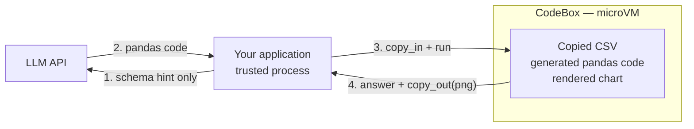

**Outcome:** a `data in -> model writes analysis -> isolated execution -> answer and chart out` pipeline.

**Level:** intermediate · **Time:** ~15 minutes · **Pattern:** the box is a tool the model calls.

## When to use this

You want a conversational data assistant: a user drops in a CSV, asks "what is revenue by region, and which product sells best?", and gets a number and a chart.

The tension is structural. To produce a real answer you must **actually run code**, and no one reviews the pandas script the model wrote. It might read other files on your machine, install something unexpected, or exhaust memory inside your process.

`CodeBox` turns that into a closed loop: **copy the data in, let the model write the code, run it in the sandbox, copy the results out.** Both the data copy and the code live inside a disposable microVM. Your process only orchestrates.

Fits: conversational analytics, automated reporting, a natural-language front end over a data catalog, and batch processing of user-uploaded datasets.

## Architecture



Three things are worth noticing:

- **Only a schema hint goes to the model.** You send the header and a few sample rows, not the dataset. That saves tokens and keeps sensitive records out of the prompt.
- **Data enters explicitly.** The sandbox sees exactly what you `copy_in` and nothing else.
- **Artifacts come back explicitly.** Text results ride out on the return value of `run()`; files come back through `copy_out()`.

## Prerequisites

- BoxLite installed and a working virtualization host — see [Installation](/getting-started/installation).
- An OpenAI-compatible LLM endpoint (`OPENAI_API_KEY`, plus `OPENAI_BASE_URL` for other providers).
- **Give the box a bigger disk.** `pandas` and `numpy` do not fit in the default `CodeBox` disk. Pass `disk_size_gb=4` — see [Trust and limits](#trust-and-limits) for what happens if you forget.

```bash
pip install boxlite openai
```

## Build it

### Step 1: data in, analysis out

```python
import asyncio
import re
from pathlib import Path

from boxlite import CodeBox
from openai import OpenAI

client = OpenAI()  # reads OPENAI_API_KEY (and OPENAI_BASE_URL if set)


def extract_code(text: str) -> str:
    """Pull the code out of a fenced block in the model's reply."""
    match = re.search(r"```(?:python)?\n(.*?)```", text, re.S)
    return (match.group(1) if match else text).strip()


async def analyze(csv_path: str, question: str) -> str:
    # 1) Send only the header and three sample rows as a schema hint
    lines = Path(csv_path).read_text().splitlines()
    schema_preview = "\n".join(lines[:4])

    response = client.chat.completions.create(
        model="<YOUR_MODEL>",  # e.g. "gpt-4o-mini", or any model id your endpoint serves
        messages=[{"role": "user", "content": (
            "You write Python that reads /data/sales.csv with pandas and prints answers. "
            "No explanation, code only.\n"
            f"CSV header and sample rows:\n{schema_preview}\n"
            f"Task: {question}"
        )}],
    )
    code = extract_code(response.choices[0].message.content)

    # 2) disk_size_gb=4 leaves room for pandas and numpy
    async with CodeBox(disk_size_gb=4) as box:
        # 3) Copy the real data into a persistent path — not /tmp, which is tmpfs
        await box.copy_in(csv_path, "/data/sales.csv")
        # 4) Install dependencies inside the box
        await box.install_packages("pandas")
        # 5) Run the generated code; run() returns stdout as a string
        return await box.run(code)


async def main() -> None:
    # Sample data; in production this is the file your user uploaded
    Path("sales.csv").write_text(
        "date,region,product,units,revenue\n"
        "2026-01-05,North,Widget,120,2400\n"
        "2026-01-05,South,Widget,90,1800\n"
        "2026-01-06,North,Gadget,40,2000\n"
        "2026-01-06,South,Gadget,75,3750\n"
        "2026-01-07,North,Widget,150,3000\n"
        "2026-01-07,South,Gadget,60,3000\n"
        "2026-01-08,North,Gadget,55,2750\n"
        "2026-01-08,South,Widget,110,2200\n"
    )

    try:
        answer = await analyze(
            "sales.csv",
            "Each region's total revenue and the single best-selling product by units.",
        )
        print(answer)
    except RuntimeError as exc:
        print(f"sandbox failed to start: {exc}")


asyncio.run(main())
```

### Step 2: render a chart and bring the PNG back

The other half of analysis is a picture. Let the sandbox render it with matplotlib and pull the file out — the rendering happens inside the isolated environment too.

```python
import asyncio

from boxlite import CodeBox

CHART_CODE = """
import pandas as pd
import matplotlib
matplotlib.use("Agg")            # required: there is no display inside the box
import matplotlib.pyplot as plt

df = pd.read_csv("/data/sales.csv")
df.groupby("region")["revenue"].sum().plot(kind="bar")
plt.title("Revenue by Region")
plt.tight_layout()
plt.savefig("/data/revenue.png")  # persistent path, so copy_out can reach it
print("chart written")
"""


async def main() -> None:
    try:
        async with CodeBox(disk_size_gb=4) as box:
            await box.copy_in("sales.csv", "/data/sales.csv")
            await box.install_packages("pandas", "matplotlib")
            print(await box.run(CHART_CODE))            # -> "chart written"
            await box.copy_out("/data/revenue.png", "revenue.png")
        print("chart saved to ./revenue.png")
    except RuntimeError as exc:
        print(f"sandbox failed to start: {exc}")


asyncio.run(main())
```

Parameter tables for `copy_in` / `copy_out`: [Moving files without a mount](/manage-sandbox/volumes#moving-files-without-a-mount). For `run` / `install_packages` / `exec`: [Run Python code in a box](/agent-tools/code-execution-python).

## Run it

```bash
export OPENAI_API_KEY="<YOUR_API_KEY>"
python data_analysis.py
```

```text
Region Revenue:
North: 10150
South: 10750

Best-selling Products:
North: Widget
South: Widget
```

Check the arithmetic against the sample data — North is 2400 + 2000 + 3000 + 2750 = 10150 — and note that the sum was computed inside the microVM, not by your process.

## Trust and limits

- **What the boundary covers.** The data copy and the generated code share one microVM with its own kernel, filesystem, and disk quota. The sandbox sees only what you copied in; `open("/etc/passwd")` in the generated code reads the sandbox's file, not yours. Nothing survives the scope exit.
- **Disk is a real constraint.** The default `CodeBox` disk cannot hold `pandas` and `numpy`. Without `disk_size_gb=4` the install fails with `OSError: [Errno 28] No space left on device` — and because `run()` returns stdout only, you see an **empty string** rather than the error. This is the most common way this guide goes wrong.
- **`run()` hides errors.** A wrong column name gives you an empty string, not a traceback. Debug with `exec("python3", "-c", code)` and read `stderr`.
- **Data movement is explicit, network access is not.** Nothing leaves the box unless you `copy_out` it — but the generated code can still open its own outbound connections. If that matters, add an egress allowlist: [Run untrusted tools safely](/use-cases/untrusted-tool-execution).

## Troubleshooting

| Symptom | Cause | Fix |
|---|---|---|
| `run()` returns an empty string and "there is no result" | `pandas` never installed, so `import pandas` failed silently — `run()` cannot show you the error | Re-run with `exec("python3", "-c", code)` and read `stderr` |
| `OSError: [Errno 28] No space left on device` while installing | The default box disk is too small for pandas + numpy | `CodeBox(disk_size_gb=4)` |
| The file you copied in is not there | The destination was on tmpfs (`/tmp`, `/dev/shm`) | Copy to a persistent path such as `/data` |
| `ModuleNotFoundError: No module named 'pandas'` | Dependencies were not installed before `run()` | `await box.install_packages("pandas", ...)` first |
| matplotlib fails with a display or backend error | It defaults to an interactive backend | `matplotlib.use("Agg")` before importing `pyplot` |
| `Model does not exist` (HTTP 400) | Model id does not match the endpoint | Use a model id that endpoint serves |

## Next steps

- **Multiple tables.** `copy_in` several CSVs under `/data/`, list every header in the schema hint, and let the model write the join.
- **Export instead of plot.** Write `.csv` / `.xlsx` / `.json` in the box and `copy_out` it the same way.
- **Start simpler** — [Build a code interpreter](/use-cases/code-interpreter) is the same loop without the data transfer.
- **Serve it over HTTP** — [Preview a sandboxed web app](/use-cases/sandboxed-web-app).
