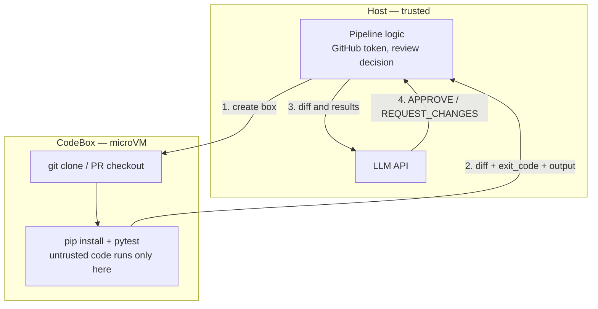

**Outcome:** a `fetch PR -> test in isolation -> model review -> APPROVE / REQUEST_CHANGES` pipeline.

**Level:** intermediate · **Time:** ~15 minutes · **Pattern:** the box is a tool the model calls.

## When to use this

Every project that accepts outside contributions carries the same hole: **running someone's PR tests means executing their code on your CI runner.** `pytest` imports `conftest.py` automatically, `pip install` executes `setup.py`, and a test body can call anything. A pull request that looks like a typo fix can read `GITHUB_TOKEN`, exfiltrate environment variables, or plant something in your build artifacts.

The usual mitigations — minimal-privilege tokens, withholding secrets from fork branches — reduce the blast radius; they do not stop the execution. Running the PR in a microVM does: the untrusted code gets its own kernel and filesystem, your orchestration logic and credentials stay in the host process, and the box is destroyed afterwards.

## Architecture



- **The execution boundary is the box.** `setup.py`, `conftest.py`, and anything inside a test run on the sandbox's kernel only.
- **Decisions and credentials stay outside.** The model call, the review verdict, and your GitHub token never enter the sandbox.
- **Results come back structured.** You read `exit_code` / `stdout` / `stderr` from `ExecResult`. A non-zero exit does not raise — which is exactly what you want for a CI decision.

## Prerequisites

- BoxLite installed and a working virtualization host — see [Installation](/getting-started/installation).
- An OpenAI-compatible LLM endpoint (`OPENAI_API_KEY`, plus `OPENAI_BASE_URL` for other providers).
- **Give the box a bigger disk.** The default `python:slim` root filesystem is around 224 MB, which cannot hold git's dependency chain — `apt-get install git` fails with `No space left on device`. Use `disk_size_gb=4`.

```bash
pip install boxlite openai
```

## Build it

To keep the example self-contained, it builds a baseline commit and a "PR" branch inside the box, where the PR introduces a real bug (`amount + amount * rate` becomes `amount + rate`). Swapping in `git clone <your repo>` changes nothing from step 4 onward — see [Next steps](#next-steps).

```python
import asyncio

from boxlite import CodeBox
from openai import OpenAI

client = OpenAI()  # reads OPENAI_API_KEY (and OPENAI_BASE_URL if set)

# --- A simulated untrusted PR: the baseline is correct, the PR breaks the tax math ---
BASE_CODE = (
    'def add_tax(amount, rate):\n'
    '    """Add tax to amount. rate is a fraction, e.g. 0.1 for 10%."""\n'
    '    return amount + amount * rate\n'
)
PR_CODE = (
    'def add_tax(amount, rate):\n'
    '    """Add tax to amount. rate is a fraction, e.g. 0.1 for 10%."""\n'
    '    # PR change: an "optimization" that introduces a bug\n'
    '    return amount + rate\n'
)
TEST_CODE = (
    'from billing import add_tax\n\n'
    'def test_ten_percent():\n'
    '    assert add_tax(100, 0.1) == 110.0\n\n'
    'def test_zero_rate():\n'
    '    assert add_tax(50, 0) == 50\n'
)

# Install git inside the box. DEBIAN_FRONTEND keeps apt from waiting on a prompt.
SETUP = r"""
set -e
export DEBIAN_FRONTEND=noninteractive
apt-get update -qq
apt-get install -y --no-install-recommends git ca-certificates >/dev/null
pip install -q pytest >/dev/null
git config --global user.email ci@example.com
git config --global user.name "ci-bot"
git config --global init.defaultBranch main
mkdir -p /work && cd /work && git init -q
"""


def _write(path: str, content: str) -> str:
    """Build a heredoc command that writes multi-line content to a file in the box."""
    return f"cd /work && cat > {path} <<'BOXLITE_EOF'\n{content}BOXLITE_EOF\n"


async def review_pr() -> str:
    # disk_size_gb=4: the default root filesystem is too small for git
    async with CodeBox(disk_size_gb=4) as box:
        # 1) Install git and pytest, initialize an isolated repository
        setup = await box.exec("bash", "-lc", SETUP)
        if setup.exit_code != 0:
            raise RuntimeError(f"environment setup failed:\n{setup.stderr}")

        # 2) Baseline commit
        await box.exec("bash", "-lc",
                       _write("billing.py", BASE_CODE) +
                       "git add -A && git commit -q -m 'base'")

        # 3) PR branch with the untrusted change and its tests
        await box.exec("bash", "-lc", "cd /work && git checkout -q -b pr-42")
        await box.exec("bash", "-lc",
                       _write("billing.py", PR_CODE) +
                       _write("test_billing.py", TEST_CODE) +
                       "git add -A && git commit -q -m 'PR #42'")

        # 4) Extract the diff to review
        diff = await box.exec("bash", "-lc",
                              "cd /work && git diff main...pr-42 -- billing.py")

        # 5) Run the tests inside the microVM — the only place untrusted code executes.
        #    exec does not raise on failure; read exit_code to decide pass/fail.
        test = await box.exec("bash", "-lc", "cd /work && python -m pytest -q")
        tests_passed = test.exit_code == 0

        # 6) Hand the diff and results to the model for a verdict
        prompt = (
            "You are a strict CI reviewer. A pull request modified billing.py.\n\n"
            f"DIFF:\n{diff.stdout}\n\n"
            f"Test output (exit_code={test.exit_code}):\n{test.stdout}\n\n"
            "Reply with one line, APPROVE or REQUEST_CHANGES, then two sentences of reasoning."
        )
        response = client.chat.completions.create(
            model="<YOUR_MODEL>",  # e.g. "gpt-4o-mini", or any model id your endpoint serves
            messages=[{"role": "user", "content": prompt}],
        )
        verdict = response.choices[0].message.content.strip()

        return (
            f"tests passed: {tests_passed} (pytest exit_code={test.exit_code})\n"
            f"--- test output ---\n{test.stdout.strip()}\n"
            f"--- review ---\n{verdict}"
        )


async def main() -> None:
    try:
        print(await review_pr())
    except RuntimeError as exc:
        print(f"sandbox failed to start: {exc}")


asyncio.run(main())
```

Parameter tables for `exec` and `ExecResult`: [Run any language or command](/agent-tools/code-execution-any-language).

## Run it

```bash
export OPENAI_API_KEY="<YOUR_API_KEY>"
python sandboxed_ci.py
```

```text
tests passed: False (pytest exit_code=1)
--- test output ---
F.                                                                       [100%]
=================================== FAILURES ===================================
_______________________________ test_ten_percent _______________________________

    def test_ten_percent():
>       assert add_tax(100, 0.1) == 110.0
E       assert 100.1 == 110.0
E        +  where 100.1 = add_tax(100, 0.1)

test_billing.py:4: AssertionError
=========================== short test summary info ============================
FAILED test_billing.py::test_ten_percent - assert 100.1 == 110.0
1 failed, 1 passed
--- review ---
REQUEST_CHANGES

The diff introduces a regression that breaks core functionality by incorrectly
calculating tax. The test failure proves the change violates the specification,
returning 100.1 instead of 110.0 for a 10% tax on 100.
```

Three things happened inside the microVM: git produced a real diff, pytest caught the injected bug with `exit_code=1`, and the model turned both into a verdict. The untrusted `billing.py` never ran on the host. End to end this takes about 19 seconds, most of it installing git.

## Trust and limits

- **What the boundary covers.** Every execution surface of the pull request — `setup.py`, `conftest.py`, test bodies, package install scripts — runs on the sandbox's own kernel and filesystem. `rm -rf /`, reading environment variables, or writing files affects the box only. Your GitHub token and review logic never enter it.
- **Network is still open by default.** This guide depends on that to install git and clone. It also means a malicious PR can make outbound requests from inside the box. For genuinely untrusted contributions, narrow egress to `github.com` and your package mirror and drop privileges with `exec(..., user="nobody")` — see [Run untrusted tools safely](/use-cases/untrusted-tool-execution).
- **`exec` never decides for you.** A failing test is a non-zero `exit_code`, not an exception. Read it. Appending `|| true` to a command silently discards that signal.
- **Startup failures are catchable.** No hypervisor or a failed image pull raises `RuntimeError` — a controlled failure, not a crash.

## Troubleshooting

| Symptom | Cause | Fix |
|---|---|---|
| `apt-get install git` exits 100 with `No space left on device` | The default `python:slim` root filesystem is ~224 MB and cannot hold git's dependency chain | `CodeBox(disk_size_gb=4)` |
| `executable 'git' not found in $PATH` | `python:slim` has no git, and the install silently failed on a full disk | Increase `disk_size_gb`, then check `exit_code` after every install step |
| apt hangs, or `debconf: unable to initialize frontend` | apt wants an interactive frontend and the sandbox has no tty | Pass `env={"DEBIAN_FRONTEND": "noninteractive"}` to `exec` |
| Tests clearly failed but the pipeline "passed" | `exec` does not raise on a non-zero exit, and a trailing `\|\| true` swallows the code | Run `python -m pytest -q` unmodified and read `result.exit_code` |
| `Model does not exist` (HTTP 400) | Model id does not match the endpoint | Use a model id that endpoint serves |
| `RuntimeError` on startup | No hardware virtualization, or the image pull failed | See [Installation](/getting-started/installation) |

## Next steps

**Review a real pull request.** Replace steps 2 and 3 of `review_pr()` with a clone — steps 4 to 6 are unchanged:

```python
# Inside review_pr(), in place of the baseline and PR-branch commits:
await box.exec("git", "clone", "--depth", "1",
               "https://github.com/<YOUR_ORG>/<YOUR_REPO>.git", "/work")
await box.exec(
    "bash", "-lc",
    "cd /work && git fetch -q origin pull/<PR_NUMBER>/head:pr && git checkout -q pr",
)
```

Other directions:

- **Private repositories and pushing back.** Keep `GITHUB_TOKEN` on the host with `Secret` and inject it through a request header — never in the clone URL. See [GitHub operations](/agent-tools/github-operations).
- **Ship code in without network access.** Prepare the working tree on the host and `box.copy_in("./pr_workdir", "/work")` instead of cloning.
- **Any language.** `exec` is language-agnostic: with the right image, `exec("bash", "-lc", "go test ./...")` works the same way. See [Run any language or command](/agent-tools/code-execution-any-language).
